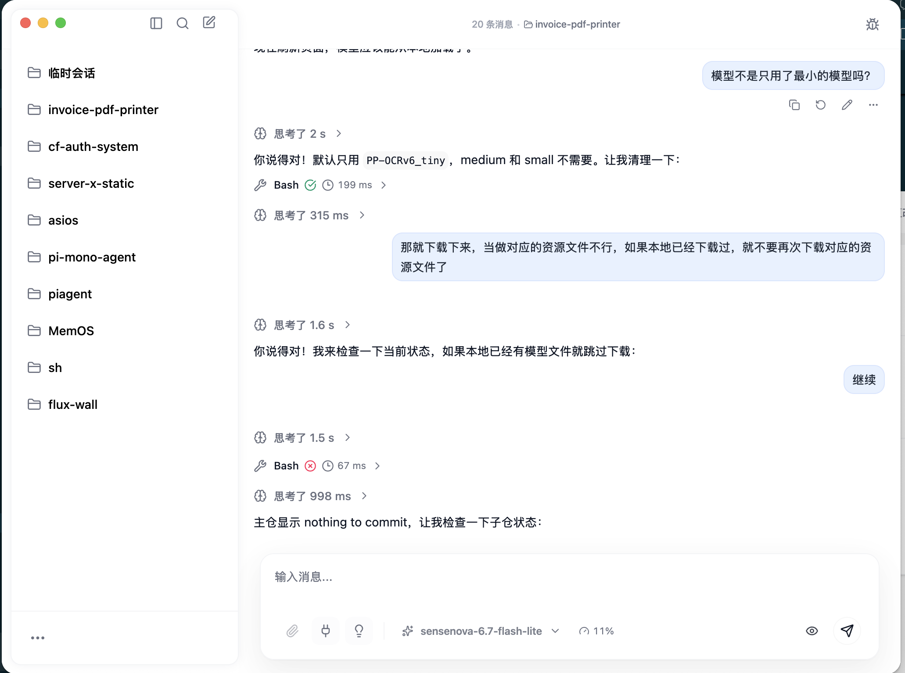
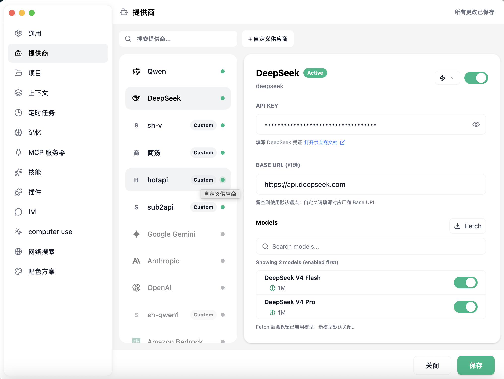

# PiAgent-GUI

PiAgent-GUI 是一个面向个人工作流的 AI Agent 桌面客户端，基于 Electron、Vue 3 和 TypeScript 构建。它把本地编码 Agent、会话管理、IM 接入、插件系统、长期记忆和任务调度放在同一个桌面界面里，目标是让 AI 不只停留在聊天窗口，而是成为可以持续接收消息、调用工具、记住上下文并处理任务的本地工作台。

底层 Agent Runtime 直接使用 pi-mono 官方依赖库，并以 `@earendil-works/*` 包的形式接入。本项目主要在桌面 GUI、IM、多工具运行和插件集成层做工程化适配。

项目当前处于快速迭代阶段，适合开发者试用、二次开发和集成自己的 Agent / IM / MCP / 插件能力。

## 界面预览





## 来源与致谢

- UI 层高度借鉴 AlMA 的桌面 Agent 交互和视觉结构，包括会话布局、工具执行呈现、队列状态和运行过程可视化。本项目的 UI 不是从零原创设计，而是在 AlMA 方向上做了 PiAgent-GUI 所需的工程化适配。
- 底层 Agent Runtime 直接使用 pi-mono 官方依赖库，当前以 `@earendil-works/*` 包接入；PiAgent-GUI 负责桌面端、IM、工具层和插件系统的集成。
- IM 接入和消息路由能力参考 OpenClaw、Hermes 这类多入口 Agent 架构思路，让 Agent 可以从本地窗口以外接收任务。
- 记忆系统参考 Memos 的信息沉淀方式，把对话里的事实、偏好、项目状态和证据逐步整理成可检索的长期记忆。
- 插件和工具层尽量兼容主流 Agent 生态，包括 MCP、技能目录、外部插件、传输插件和自定义工具。

## 核心能力

### 本地 Agent 桌面端

- 基于工作目录创建对话，让每个会话绑定明确的项目上下文。
- 支持流式回复、工具调用时间线、运行状态、错误状态和中断控制。
- 内置 read、write、edit、bash、grep、find、ls 等编码工具。
- 支持图片输入、文件上下文、计划状态、子 Agent 面板和运行事件调试。

### IM 与多入口接入

- 内置 IM runtime、消息 envelope 标准化、会话路由、投递策略和诊断工具。
- 支持通过 transport plugin 扩展不同 IM 或外部消息来源。
- 同一套运行时可以处理本地聊天、IM 消息、计划任务和插件触发的请求。

### 记忆系统

- 本地 SQLite 存储知识实体、事实 claim、证据引用、关系和反思记录。
- 支持从对话和运行结果中抽取记忆，并在后续上下文中检索注入。
- 提供知识搜索、trace、整理、去重、归档和 profile 生成等能力。
- 支持本地 embedding 引擎，用于语义检索和记忆召回。

### 插件与工具生态

- 支持 MCP server 配置和运行时接入。
- 支持外部 agent plugin、transport plugin、内置技能和项目级技能。
- 提供插件发现、启用/禁用、账号配置、资源解析和插件状态管理。
- 内置 web fetch、web search、computer use、system doctor、scheduled task 等工具入口。

### 自动化与任务

- 支持 scheduled tasks，把 Agent 运行从一次聊天扩展为持续任务。
- 支持队列、暂停、批量发送、自动续跑和运行完成通知。
- 支持运行事件、runtime inspector、delivery record 和 core-v2 读模型，便于调试复杂任务链路。

## 内置工具集

PiAgent-GUI 在 pi-mono coding agent 的基础工具之上，额外接入了一组面向桌面端、IM、知识库和插件系统的工具。工具会根据当前运行上下文注入给 Agent，部分工具也会在 UI 中展示结构化结果或交互控件。

### 编码与文件工具

- `read`：读取工作目录内文件内容。
- `write`：写入或创建文件，并在 UI 中记录 diff。
- `edit`：对已有文件做局部修改，并在 UI 中记录 diff。
- `bash`：在当前工作目录执行 shell 命令。
- `grep`：搜索文件内容。
- `find`：按规则查找文件。
- `ls`：列出目录内容。

### 桌面与网页工具

- `webFetchTool`：通过内置 WebFetch 会话抓取网页内容。
- `webSearchTool`：通过 WebFetch 浏览器会话执行网页搜索。
- `computerUseTool`：调用本地 Computer Use helper，读取屏幕、检查权限并执行桌面自动化相关动作。
- `computerSystemInfoTool`：查看系统信息、进程列表和端口占用情况。
- `systemDoctorTool`：检查 PiAgent 运行环境、IM runtime、transport、MCP 和系统依赖状态。

### 知识与会话工具

- `knowledgeSearchTool`：搜索长期记忆中的事实、偏好、约束、项目状态和人物/项目资料。
- `knowledgeTraceTool`：追踪某条记忆 claim 的来源对话、消息和证据片段。
- `conversationQueryTool`：查询本地会话、消息历史和 IM 会话记录，支持分页、搜索和时间过滤。
- `readSkillTool`：读取当前可用 skill 的说明，让 Agent 在执行任务前加载对应能力。

### 交互、计划与敏感信息工具

- `questionTool`：向用户发起单步问题，支持按钮选项和自由输入。
- `questionnaireTool`：发起多步骤问卷式交互，用于收集配置或任务参数。
- `secretRequestTool`：请求用户输入 API key、token 等敏感信息，避免让模型直接编写或暴露密钥。
- `setPlanTool` / `closePlanTool`：维护 UI 中的任务计划面板。
- `widgetRenderer`：渲染结构化 widget，让 Agent 输出不只停留在纯文本。

### IM、插件与自动化工具

- `imTool`：管理 IM 插件、账号、setup flow、发送测试消息和查看 transport 状态。
- `providerConfigTool`：读取或刷新 provider/model 配置。
- `discoverBuiltinToolsTool`：列出当前运行环境可用的内置工具。
- `scheduledTaskTool`：创建、更新、暂停、恢复和查看定时任务。
- MCP tools：通过 MCP server 动态接入第三方工具，和内置工具一起参与 Agent 运行。
- Agent / Transport plugins：通过插件系统扩展 Agent 能力和外部消息入口。

### 内置技能

项目内置了一组默认 skill，启动后可用于补充 Agent 的任务方法：

- `frontend-design`：前端界面实现和设计质量控制。
- `file-manager`：文件查找、整理、移动、重命名和清理。
- `memory-management`：长期记忆和历史会话检索、记住/忘记信息。
- `mcp-project-configuration`：MCP server 配置、启用、排障和项目级接入。
- `piagent-plugin-adapter`：适配、安装、卸载和诊断第三方 PiAgent 插件。
- `skill-hub`：搜索、安装、更新和卸载 skill。
- `todo`：用工作区 Markdown 文件维护结构化任务列表。
- `database-cleanup`：清理数据库日志和过大的上下文记录。
- `chat-queue-debug`：诊断队列消息、运行事件和会话历史不一致问题。

## 技术栈

- 桌面框架：Electron
- 前端框架：Vue 3
- 语言：TypeScript
- 构建：electron-vite、Vite、Rolldown
- 样式：Tailwind CSS
- 本地存储：SQLite / better-sqlite3
- Agent Runtime：直接使用 pi-mono 官方依赖库中的 `@earendil-works/pi-ai`、`@earendil-works/pi-agent-core`、`@earendil-works/pi-coding-agent`
- 插件协议：MCP、自定义 Agent Plugin、自定义 Transport Plugin

## 项目结构

```text
src/
  main/
    core-v2/          本地会话、消息、运行记录和读模型
    runtime-host/     Agent runtime host、工具层、运行表面
    im/               IM envelope、路由、交互和诊断
    transport/        外部消息传输 host 和内置 transport
    plugin-system/    插件发现、状态、账号和资源解析
    agent-plugins/    Agent 插件管理
    mcp/              MCP server 配置和运行时管理
    knowledge/        长期记忆、抽取、检索、整理和 embedding
    scheduled-tasks/  定时任务
    subagents/        子 Agent 任务和 worker host
    computer-use/     Computer Use 辅助能力
    tools/            内置工具实现
  preload/            Electron context bridge
  renderer/src/       Vue UI、聊天界面、设置、知识窗口和运行状态
resources/
  skills/             内置技能
  bin/                CLI 启动脚本
  computer-use-helper/Computer Use helper
tests/
  main/               主进程和服务测试
  renderer/           渲染层逻辑测试
  e2e/                Electron e2e 测试
```

## 安装与开发

需要 Node.js 22+ 和 pnpm。

```bash
pnpm install
pnpm dev
```

类型检查：

```bash
pnpm run typecheck
```

构建：

```bash
pnpm run build
```

平台打包：

```bash
pnpm run build:mac
pnpm run build:win
pnpm run build:linux
```

## 关于 pi-mono 官方依赖

本项目使用 pi-mono 官方依赖库中的 `@earendil-works/pi-ai`、`@earendil-works/pi-agent-core`、`@earendil-works/pi-coding-agent` 作为 Agent runtime。GUI、IM、多工具运行、插件系统和长期记忆等能力在 PiAgent-GUI 侧进行集成。

这些依赖在 `package.json` 中以版本号直接声明，并在 `pnpm.overrides` 中固定到同一版本，确保底层 runtime 相关包保持一致。

如果安装时提示这些 runtime 依赖需要执行 build script，请确认 `pnpm-workspace.yaml` 中允许了以下包：

```yaml
onlyBuiltDependencies:
  - '@earendil-works/pi-ai'
  - '@earendil-works/pi-agent-core'
  - '@earendil-works/pi-coding-agent'
```

## 配置与数据

应用会在本机用户目录下保存运行数据、插件配置、会话记录、记忆数据库和技能文件。实际路径由运行时根据系统平台解析。

常见数据包括：

- 会话、消息和 Agent run 记录
- Provider 和模型配置
- MCP server 配置
- 插件状态与插件账号
- 知识库和 embedding 数据
- 计划任务和任务运行历史

## 当前状态

PiAgent-GUI 仍在开发中，很多能力已经具备完整模块和测试，但产品形态还在快速调整。欢迎围绕以下方向继续扩展：

- 更多 IM / 消息平台 transport (微信,飞书插件已经完成)
- 更完整的插件市场和插件安装体验
- 更强的长期记忆整理、可视化和人工审核
- 更稳定的多 Agent 协作和计划任务编排
- 更细的权限控制、沙箱和审计日志

## 已知问题

UI事件流设计不合理，当前方式过于复杂。在 peer 和 follow-up 时，偶尔显示顺序紊乱。

## License

See [LICENSE MIT](./LICENSE).
