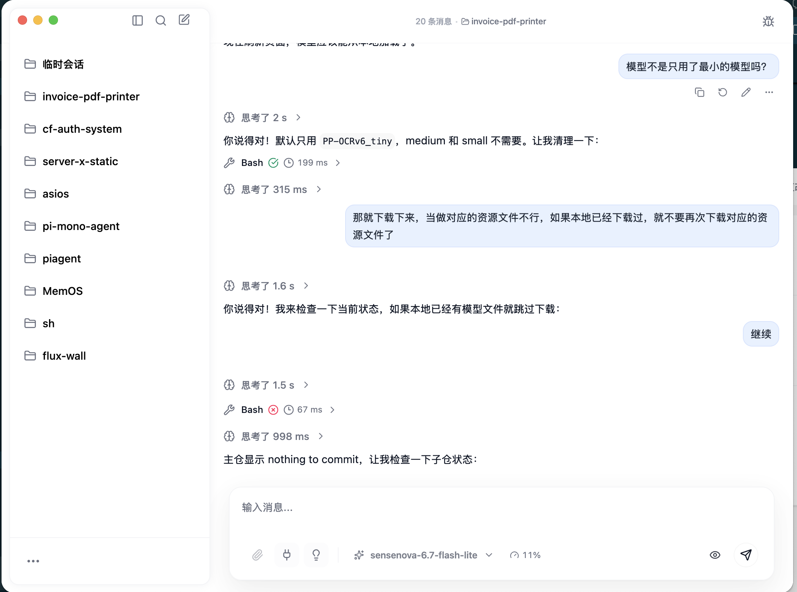
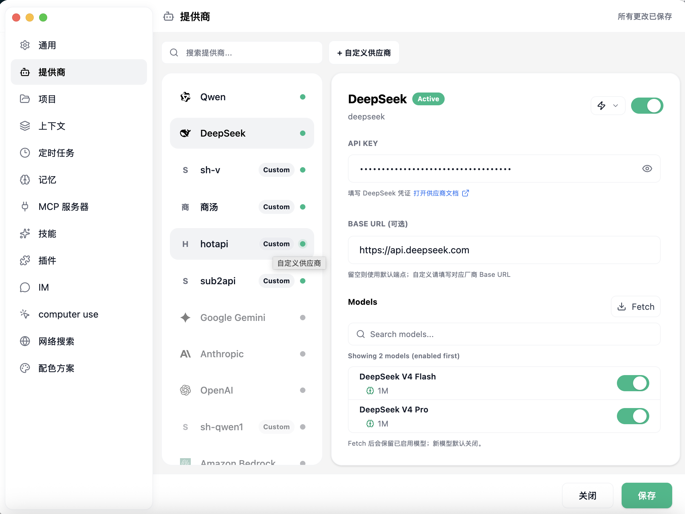

# PiAgent-GUI

**面向本地 AI Agent 的桌面工作台。** PiAgent-GUI 基于 Electron、Vue 3 和 TypeScript 构建，将本地编码 Agent、会话与运行流、消息入口、扩展生态、长期记忆和计划任务整合到一个本地优先的桌面应用中。

底层 Agent runtime 使用 [pi-mono](https://github.com/earendil-works/pi) 的 `@earendil-works/pi-*` 包；PiAgent-GUI 聚焦于桌面交互、运行编排和本地集成体验。

## 界面预览





## 为什么是 PiAgent-GUI

让 Agent 在桌面端完成的不只是一次问答：它可以在明确的工作目录和会话上下文中执行编码任务，持续呈现运行过程，并通过消息入口、插件、记忆与定时任务融入日常工作流。数据与运行状态保留在本机，便于开发者按自己的模型、工具和协作方式扩展。

## 快速开始

需要 Node.js 22+ 和 pnpm。

```bash
git clone https://github.com/EnjoyWT/PiAgent-GUI.git
cd PiAgent-GUI
pnpm install
pnpm dev
```

启动后，在应用中配置可用的 Provider 与模型，即可创建绑定工作目录的 Agent 会话。

## 核心能力

### 面向编码任务的本地工作台

- 以工作目录为上下文创建会话，适合本地代码库中的连续任务。
- 呈现流式回复、工具调用、运行状态和中断控制，帮助理解 Agent 正在执行什么。
- 支持文件与图片上下文，让对话更贴近真实项目工作。

### 会话、运行流与多入口协作

- 统一处理本地聊天、外部消息、计划任务和插件触发的 Agent 请求。
- 保存会话、消息与运行记录，方便回看上下文和执行过程。
- 通过 IM / transport plugins 接入不同的消息来源，将 Agent 带出单一聊天窗口。

### 可组合的 Agent 扩展生态

- 支持 MCP server，将第三方工具接入 Agent 运行时。
- 支持 Agent plugins、transport plugins 与 Skills，按需扩展能力和消息入口。
- 提供 Provider、插件和运行环境的本地配置入口，适配个人工作流。

### 可检索的长期记忆

- 将对话和运行中的有用信息沉淀为本地长期记忆。
- 支持围绕事实、偏好、项目状态和证据进行检索，帮助后续任务延续上下文。

### 自动化与持续任务

- 支持 scheduled tasks，把一次性的 Agent 运行扩展为可持续执行的任务。
- 结合运行记录与消息投递，让自动化任务的状态更容易追踪。

## 配置与扩展

应用在本机保存 Provider 与模型配置、会话和运行记录、插件状态、MCP server、长期记忆和计划任务等数据。具体存储位置由运行时按平台解析。

PiAgent-GUI 可通过以下方式适配你的环境：

- 配置 Provider 与模型，用于本地会话中的 Agent 运行。
- 添加 MCP server，向 Agent 提供外部工具。
- 安装或启用 Agent / transport plugins，扩展能力与消息入口。
- 使用内置或项目级 Skills，为特定任务补充工作方法和约束。

## 架构概览

```text
Electron Desktop App
├── Vue 3 Renderer：聊天、设置与运行状态
├── Main Process：会话、运行编排与本地服务
│   ├── pi-mono runtime（@earendil-works/pi-*）
│   ├── MCP、Agent plugins 与 Skills
│   ├── IM / transport plugins 与消息路由
│   ├── 长期记忆与本地数据存储
│   └── scheduled tasks
└── Preload：安全的桌面端桥接
```

## 开发与验证

```bash
# 安装依赖并启动开发环境
pnpm install
pnpm dev

# 类型检查与逻辑测试
pnpm run typecheck
pnpm run test:logic

# 生产构建
pnpm run build

# 平台打包
pnpm run build:mac
pnpm run build:win
pnpm run build:linux
```

## 项目状态与参与贡献

当前版本为 `0.0.6`，项目仍在快速迭代中。欢迎围绕本地 Agent 体验、消息 transport、MCP 与插件生态、长期记忆和任务自动化提交 issue、讨论或 pull request。

## License

[MIT](./LICENSE)

## 致谢

- [pi-mono](https://github.com/earendil-works/pi) 及其 `@earendil-works/pi-*` runtime 包，为本项目提供底层 Agent 运行能力。
- AlMA 的桌面 Agent 交互与视觉结构，为 PiAgent-GUI 的界面工程化适配提供了重要参考。
- OpenClaw、Hermes 等多入口 Agent 架构的实践，为消息接入与路由设计提供了启发。
- Memos 的信息沉淀思路，为长期记忆的组织方式提供了参考。
